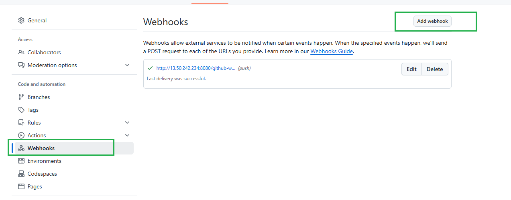

# Jenkins-FreeStyle-Project

#### JENKINS JOB

A Jenkins Job is a configurable task or project in Jenkins that defines a series of automated steps—such as building, testing, and deploying code—that Jenkins can execute.Jenkins Jobs are integral to continuous integration and continuous delivery (CI/CD) practices. They allow teams to automate and streamline their development workflows by scheduling repetitive tasks, running tests on code commits, and deploying applications once the build is successful.

#### Creating a FREESTYLE project

Lets create our first build job

i.From the dashboard menu on the left hand,click on "New Item"

ii.Create a freestyle project and name it My-First-Job

### Connecting JENKINS to our source Code Management

Now,connect JENKINS with github

i. Create a new github repository named jenkins-scm with a README.md file.

ii.Connect "Jenkins" with "jenkins-scm" by pasting the repository url in the area selected below. Make sure your current branch is main.

For Freestyle Projects:

a)Scroll down to the “Source Code Management” section.

b)Select Git.

c)In the Repository URL field, enter your GitHub repo URL.

iii)Save the configuration and run Build now to connect Jenkins to our github repositorty.

we have successfully connected jenkins with our git hub repository(jenkins-scm)

### Configuring Build Triggers.

Build triggers in Jenkins are mechanisms that automatically start a build of your project based on certain conditions.As an Engineer,you need to be able to automate things and make our work easier every possible way.We cannot rely on BUILD NOW everytime we neeed to run a job.To solve this,we can confgure build triggers for our project.With this jenkins will run a new build anytime there is a change in our code/repository.

i.Click on your job(My-First-Job) and click on Configure.

ii.a) Click on build trigger to configure triggering the job from GitHub webhook.

b) Check the box in "GitHub hook trigger for GITScm polling".

c) Apply and save.

iii.Create a GitHub webhook using Jenkins ip address and port.

Find Your Jenkins Server URL
Ensure your Jenkins server is accessible from the internet and you know its URL. This typically includes the IP address and port number, for example: `http://<your-jenkins-ip>:8080/`

S Set Up the GitHub Webhook
Go to Your GitHub Repository:

a) Navigate to the repository you want to connect with Jenkins on GitHub.

b) Navigate to Webhooks Settings:

Click on Settings in your repository.

In the sidebar, select Webhooks.

Click Add webhook.

Configure the Webhook:by click add webhook

Payload URL: Enter the URL of your Jenkins server with the GitHub webhook endpoint. For example: `http://<your-jenkins-ip>:8080/github-webhook/`
Content type: Select `application/json`.

Secret: You can set a secret for security purposes, but it is optional.

Which events would you like to trigger this webhook? Select Just the push event or Let me select individual events as per your requirements.

Click Add webhook.

Step 4: Test the Webhook

Trigger a Build:

Push a change to your GitHub repository.

Verify in Jenkins:

Go to Jenkins and check the build history of your project.

If everything is set up correctly, a new build should be triggered by the webhook

