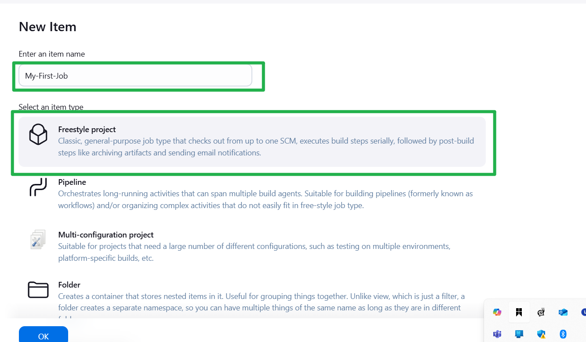

# Introduction-to-JENKINS

**Continuous Integration and Continuous Delivery (CI/CD)** is a software development practice that automates and streamlines the process of integrating code changes, testing them, and deploying applications. 

- **Continuous Integration (CI):**  
  Developers frequently commit code to a shared repository. Each change automatically triggers builds and tests, ensuring that new code integrates smoothly with the existing codebase and that any issues are identified early.

- **Continuous Delivery/Deployment (CD):**  
  After a successful integration and testing phase, the code is automatically prepared for release. Continuous Delivery ensures that the software is always in a deployable state, while Continuous Deployment goes a step further by automatically deploying every change to production once it passes the testing phase.

Overall, CI/CD improves development efficiency, accelerates product releases, and reduces the risk of bugs in production by promoting an automated, consistent, and rapid development workflow.


### What is JENKINS.

Jenkins is an open-source automation server that plays a key role in continuous integration and continuous delivery (CI/CD). It automates the building, testing, and deployment of software, ensuring that code changes are integrated frequently and reliably. Jenkins achieves this through a rich ecosystem of plugins, which allow it to integrate seamlessly with various tools and technologies used in modern development workflows. This makes it an essential tool for agile teams and DevOps practices, streamlining the path from code commit to production deployment.

Prerequisites
- A Linux-based operating system (e.g., Ubuntu).
- Root or sudo access to the Linux server.


### Getting Started with JENKINS

#### Installation of Jenkins

- log to the ubuntu server

**Update package repositories**


```bash
sudo apt update
```

- The command is used on Debian-based systems (like Ubuntu) to refresh the package lists from the repositories. This means it downloads the latest package information, allowing you to see if there are newer versions available. It’s an essential step before installing or upgrading packages to ensure you're working with the most current information on available software.

 

**Install (java) JDK**


```bash
sudo apt install default-jdk-headless
```

The command installs the **default Java Development Kit (JDK) for headless environments** on your Ubuntu system. Here's what that means:

- **Default JDK:**  
  This package provides the standard JDK recommended for your version of Ubuntu. It allows you to compile and run Java applications.

- **Headless:**  
  The term "headless" indicates that the package does not include the graphical components (like GUI libraries) typically part of the full JDK. This is ideal for server environments or situations where you don't need a graphical interface, reducing resource usage.

- **Usage Scenario:**  
  Use this command when you need to run or develop Java applications on a server or any environment without a display, such as a cloud instance or in automated build pipelines.

After running this command, you'll have the essential tools needed to compile and run Java applications without the overhead of GUI-related components.

  

 **Install JENKINS**

 1}  Add the Jenkins GPG key for package verification
    
  ```
  wget -q -O - https://pkg.jenkins.io/debian-stable/jenkins.io.key | sudo apt-key add -
  ```
  
 2}  Add the jenkins repository

  ```
  sudo sh -c 'echo deb https://pkg.jenkins.io/debian-stable binary/ > \ /etc/apt/sources.list.d/jenkins.list'

  ```
 
 3} This ensures access to the latest package versions available in the repositories.

   ```
    sudo apt update
    sudo apt-get install jenkins
   ```

   

 Theses command installs jenkins.It involves importing the jenkins GPG key for package verification,adding the jenkins repository to the system sources, updating package list and finally,installing jenkins through the package manager(apt-get)

 #### Verify Jenkins Installation

 Check if JENKINS has been installed,up and running
 
  ```
  sudo systemctl status jenkins
 
  ```

  - If `active` , jenkins is successfully installed.

 

 ### Configure Network Setting

**In our instance,create new inbound rule for port 8080 in security group**

By default, Jenkins listens on port **8080**. Ensure this port is open for inbound traffic in your instance’s security group:
- **Create a new inbound rule** for port **8080** in your cloud provider’s security group.


**Set up Jenkins on a Web Console**

a) Input your JENKINS instance ip address on your web browser.

`http://public_ip:8080`

 

b) Retrieve the initial administrator password:

On your Jenkins instance,run the command:

 `cat var/lib/jenkins/secrets/initialAdminPassword` 

 

c) Install suggested pluggins

- Follow the on-screen instructions to install commonly used plugins.


 

d) Create a New Administrator User:
- Set up your admin account as prompted.


 

e) Access the JENKINS dashboard.

  `http://<your_public_ip>:8080`

  

JENKINS HAS BEEN SUCCESSFULLY INSTALLED CAN BE ACCESSED ON THE JENKINS CONSOLE/DASHBOARD on the web.

### TEST CARRIED OUT

### **4. Testing Jenkins Installation**

Once Jenkins has been installed, it’s essential to perform a series of tests to confirm that the installation is functional and that Jenkins is correctly configured. Below are the steps carried out to validate the setup:

---

#### **Pre-Installation Validation**
1. **Update Package Repository**:
   - Ensured that the system's package repository was up to date by executing:
     ```bash
     sudo apt update
     ```
   - This step confirmed that all system packages were updated before the installation began.

2. **Verify JDK Installation**:
   - Installed the default headless JDK required for Jenkins using:
     ```bash
     sudo apt install default-jdk-headless
     ```
   - Verified the successful installation by checking the Java version:
     ```bash
     java -version
     ```

---

#### **Jenkins Installation Validation**
1. **Repository Setup and Installation**:
   - Imported the Jenkins GPG key and added the repository without any errors.
   - Updated the package list and installed Jenkins with:
     ```bash
     sudo apt update
     sudo apt-get install jenkins
     ```

2. **Service Status Check**:
   - Verified that the Jenkins service was installed and running using:
     ```bash
     sudo systemctl status jenkins
     ```
   - Checked service logs to ensure there were no errors or misconfigurations during startup.

---

#### **Network Configuration Validation**
1. **Port 8080 Accessibility**:
   - Confirmed that the security group associated with the server allowed inbound traffic on port **8080**, as this is the default port for Jenkins.
   - Tested connectivity by accessing the Jenkins dashboard in a web browser at:
     ```
     http://<your_public_ip>:8080
     ```

2. **Command-Line Connectivity Test**:
   - Optionally used `curl` from another machine to verify that the Jenkins web interface was reachable:
     ```bash
     curl http://<your_public_ip>:8080
     ```

---

#### **Initial Setup Validation**
1. **Admin Password Retrieval**:
   - Extracted the initial admin password using:
     ```bash
     sudo cat /var/lib/jenkins/secrets/initialAdminPassword
     ```
   - Used the retrieved password to unlock the Jenkins interface in the web browser.

2. **Plugin Installation**:
   - Followed the on-screen instructions to install the suggested plugins.
   - Verified that plugins were installed without any errors.

3. **User Account Creation**:
   - Created a new administrator account as prompted during the setup process.
   - Logged into the Jenkins dashboard to confirm successful account creation and accessibility.

---

### **Test Results**
- The Jenkins splash screen loaded successfully, confirming network connectivity and proper service operation.
- Suggested plugins were installed, and the Jenkins web interface was operational.
- An administrator account was created, completing the initial setup.

With all tests successfully completed, Jenkins is confirmed to be fully functional and ready for use in your CI/CD workflows. 


# Jenkins-FreeStyle-Project

#### JENKINS JOB

A Jenkins Job is a configurable task or project in Jenkins that defines a series of automated steps—such as building, testing, and deploying code—that Jenkins can execute.Jenkins Jobs are integral to continuous integration and continuous delivery (CI/CD) practices. They allow teams to automate and streamline their development workflows by scheduling repetitive tasks, running tests on code commits, and deploying applications once the build is successful.

#### Creating a FREESTYLE project

Lets create our first build job

i.From the dashboard menu on the left hand,click on "New Item"


ii.Create a freestyle project and name it My-First-Job



### Connecting JENKINS to our source Code Management

Now,connect JENKINS with github

i. Create a new github repository named jenkins-scm with a README.md file.

ii.Connect "Jenkins" with "jenkins-scm" by pasting the repository url in the area selected below. Make sure your current branch is main.

For Freestyle Projects:

a)Scroll down to the “Source Code Management” section.

b)Select Git.

c)In the Repository URL field, enter your GitHub repo URL.


iii)Save the configuration and run Build now to connect Jenkins to our github repositorty.


we have successfully connected jenkins with our git hub repository(jenkins-scm)

### Configuring Build Triggers.

Build triggers in Jenkins are mechanisms that automatically start a build of your project based on certain conditions.As an Engineer,you need to be able to automate things and make our work easier every possible way.We cannot rely on BUILD NOW everytime we neeed to run a job.To solve this,we can confgure build triggers for our project.With this jenkins will run a new build anytime there is a change in our code/repository.

i.Click on your job(My-First-Job) and click on Configure.


ii.a) Click on build trigger to configure triggering the job from GitHub webhook.

b) Check the box in "GitHub hook trigger for GITScm polling".

c) Apply and save.


iii.Create a GitHub webhook using Jenkins ip address and port.

Find Your Jenkins Server URL
Ensure your Jenkins server is accessible from the internet and you know its URL. This typically includes the IP address and port number, for example: `http://<your-jenkins-ip>:8080/`

S Set Up the GitHub Webhook
Go to Your GitHub Repository:

a) Navigate to the repository you want to connect with Jenkins on GitHub.

b) Navigate to Webhooks Settings:

Click on Settings in your repository.

In the sidebar, select Webhooks.

Click Add webhook.


Configure the Webhook:by click add webhook


Payload URL: Enter the URL of your Jenkins server with the GitHub webhook endpoint. For example: `http://<your-jenkins-ip>:8080/github-webhook/`
Content type: Select `application/json`.

Secret: You can set a secret for security purposes, but it is optional.

Which events would you like to trigger this webhook? Select Just the push event or Let me select individual events as per your requirements.

Click Add webhook.


Step 4: Test the Webhook

Trigger a Build:

Push a change to your GitHub repository.


Verify in Jenkins:

Go to Jenkins and check the build history of your project.

If everything is set up correctly, a new build should be triggered by the webhook


# Jenkins-Pipeline-Job

A Jenkins Pipeline Job is a powerful and flexible way to define and automate the continuous integration and continuous delivery (CI/CD) process as code in Jenkins.Jenkins Pipeline Jobs offer a robust and flexible way to automate the entire CI/CD process, enabling teams to deliver software more efficiently and reliably. By defining your pipeline as code, you can leverage the full power of version control, automation, and collaboration, ensuring a streamlined and effective development workflow.


### Creating a Pipeline Job

i. Click on New Item from the dashboard of the jenkins server.


ii. Create a pipeline job and name it My-Pipeline-Job or any desired name and click ok.


### Configuring Build Triggers for the pipeline Job

Click on the github repository

Click on settings and Webhook on the left hand side.

Click add webhook,add the jenkins server ip address and port and the extenstion `git-webhook`

click add webhook


iii.Click configure and add thise build triggers .Check the "GitHub hook trigger for GITScm polling"

Apply and Save


### Writing Jenkins Pipeline Script

A Jenkins Pipeline Script is a code-based way to define your Continuous Integration/Continuous Delivery (CI/CD) pipeline using Jenkins. It allows you to automate your build, test, and deployment processes as code. Jenkins Pipeline scripts are written using a domain-specific language (DSL) based on Groovy. There are two main types of Jenkins Pipeline scripts, Declarative and scripted.Jenkins Pipeline scripts are a powerful way to define and automate your CI/CD processes, enabling you to deliver software more efficiently and reliably. Whether you choose the simpler Declarative Pipeline or the more flexible Scripted Pipeline, you can customize your pipeline to fit your project's needs.


```groovy
pipeline {
    agent any

    stages {
        stage('Connect To GitHub') {
            steps {
                checkout scmGit(branches: [[name: '*/main']], extensions: [], userRemoteConfigs: [[url: 'https://github.com/Edward-okoto/Jenkins-Pipeline-Job.git']])
            }
        }
        stage('Build Docker Image') {
            steps {
                script {
                    sh 'docker build -t dockerfile .'
                }
            }
        }
        stage('Run Docker Container') {
            steps {
                script {
                    sh 'docker run -itd -p 8081:80 dockerfile'
                }
            }
        }
    }
}
```

### Explanation

- **pipeline { ... }**: Defines the pipeline.
- **agent any**: Specifies that the pipeline can run on any available Jenkins agent.
- **stages { ... }**: Groups the various stages of the pipeline.
- **stage('Connect To GitHub') { ... }**: The stage where the repository is cloned from GitHub.
- **checkout scmGit { ... }**: Uses the Git plugin to clone the specified branch of the repository.
- **stage('Build Docker Image') { ... }**: The stage where the Docker image is built.
- **sh 'docker build -t dockerfile .'**: Runs a shell command to build the Docker image with the tag "dockerfile".
- **stage('Run Docker Container') { ... }**: The stage where the Docker container is run.
- **sh 'docker run -itd -p 8081:80 dockerfile'**: Runs a shell command to start the Docker container, mapping port 8081 on the host to port 80 on the container.

iv. Copy the pipeline script above and past it in the section below.


Stage 1 of the script connect jenkins to github repository.To generate syntax for your repository,follow the steps below.

i.Click on the pipeline syntax.


ii. Select the drop down to search for `checkout: Check out from version control`


iii.Paste your repository url and make sure your branch is main.


iv.Generate your pipeline syntax.


Now you can replace your generated script for connecting jeckins with github.

### Installing Docker

Before Jenkins can run docker commands,we need to install docker on the same instance Jenkins was installed.

i.Create a file names docker.sh on the jenkins instance.

ii.Open the file and paste the script below.

```bash
#!/bin/bash

# Update package list and install prerequisites
sudo apt-get update -y
sudo apt-get install -y ca-certificates curl gnupg

# Set up the Docker keyrings directory and add Docker's official GPG key
sudo install -m 0755 -d /etc/apt/keyrings
curl -fsSL https://download.docker.com/linux/ubuntu/gpg | sudo gpg --dearmor -o /etc/apt/keyrings/docker.gpg
sudo chmod a+r /etc/apt/keyrings/docker.gpg

# Add Docker's official repository to Apt sources
echo \
  "deb [arch=$(dpkg --print-architecture) signed-by=/etc/apt/keyrings/docker.gpg] https://download.docker.com/linux/ubuntu \
  $(. /etc/os-release && echo "$VERSION_CODENAME") stable" | \
  sudo tee /etc/apt/sources.list.d/docker.list > /dev/null

# Update package list again to include Docker packages
sudo apt-get update -y

# Install Docker Engine and associated components
sudo apt-get install -y docker-ce docker-ce-cli containerd.io docker-buildx-plugin docker-compose-plugin

# Check the status of the Docker service
sudo systemctl status docker
```


iii.Save and close the file.

iv.make the file executable.

    chmod u+x docker.sh

v.Execute the file

    ./docker.sh


we have successfully installed DOCKER.

### Add jenkins user to docker group.


1. **Add Jenkins user to Docker group:**
   ```bash
   sudo usermod -aG docker jenkins
   ```

2. **Restart Jenkins service:**
   ```bash
   sudo systemctl restart jenkins
   ```

3. **Restart Docker service:**
   ```bash
   sudo systemctl restart docker
   ```

4. **Verify Docker group membership:**
   ```bash
   groups jenkins
   ```

This ensures the Jenkins user has the necessary permissions to interact with the Docker daemon. After making these changes, try running your pipeline again.

### Building Pipeline Script

Now that we have docker installed on the same instance as jenkins,we need to create a docker file before we can run our pipeline script.We cannot build a docker image without a docker file.

i. Create a dockerfile and paste this below.


```Dockerfile
# Use the official NGINX base image
FROM nginx:latest

# Set the working directory in the container
WORKDIR /usr/share/nginx/html/

# Copy the local HTML file to the NGINX default public directory
COPY index.html /usr/share/nginx/html/

# Expose port 80 to allow external access
EXPOSE 80
```

ii.Create an index file and paste the content below

    Congratulations, You have successfully run your first pipeline code.

Pushing these files dockerfile and index.html will trigger jenkins to automatically run new build for our pipeline.


To access the content of our index.html file on our web browser.Edit inbound rules and open the port mapped to our container (port:8081)


we can now access the content of our index.html file on our web browser

    http://jenkins-ip-address:8081


